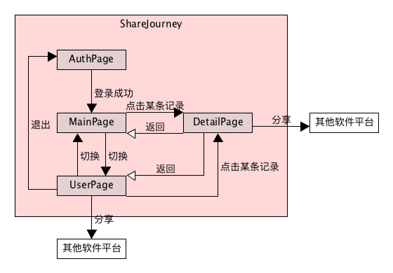
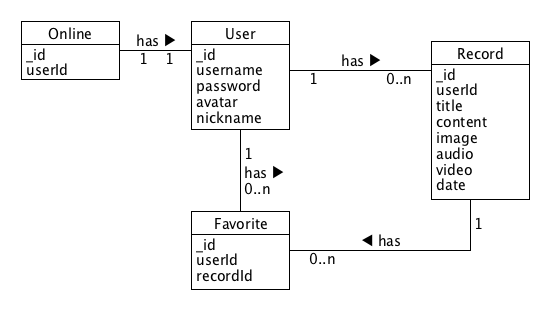

Share Journey 嘻游记
> TAGs：分享、旅行记录、UWP Midterm project

# 1、协作规范
#### 1.1、准备工作
在github上fork我的仓库到你自己的github，将你fork之后自己的远程仓库克隆到本地，并在你的本地仓库上添加上游仓库，即源仓库(我的仓库)。
```bash
git clone https://github.com/{你的github}/ShareJourney
# 添加上游的源仓库地址，只需添加一次，后续不必再次添加
git remote add upstream https://github.com/hongchh/ShareJourney.git
```
#### 1.2、协作方式
开发完成某个功能，提交(commit)之后，同步(pull)上游仓库的更新。同步完成之后再将所有更新推送(push)到你自己的GitHub远程仓库上。最后再给我发送PR等待我的合并即可。
```bash
# 提交你的代码
git add *
git commit -m "add something"
# 拉取上游的源仓库dev分支上的更新，可能会有冲突需要自行解决
git pull upstream master
# 推送到你自己的远程仓库，注意这里是push到origin，不是upstream
git push origin master
```

# 2、界面结构
* MainPage: 主页面，显示多条旅行记录，点击某一条可以跳转到DetailPage
* DeatilPage: 详情页面，显示某条记录的详情
* UserPage: 用户个人信息页面，显示用户个人信息以及该用户发布的历史记录，点击某一条历史记录可以跳转到DetailPage
* AuthPage: 登录注册页面，成功登陆之后跳转到MainPage



# 3、数据模型
用户数据模型
```json
{
  "user": {
    "_id": "uid, 数据库ID",
    "username": "string, 用户名",
    "password": "string, 密码",
    "nickname": "string, 昵称",
    "avatar": "string, 用户头像图片对应的URL"
  }
}
```
记录数据模型
```json
{
  "record": {
    "_id": "uid, 数据库ID",
    "userId": "uid, 发布该记录的用户的数据库ID",
    "title": "string, 标题",
    "content": "string, 描述",
    "image": "string, 图片链接URL",
    "audio": "string, 音频链接URL",
    "video": "string, 视频链接URL",
    "date": "date, 该记录发布时间的时间戳"
  }
}
```
点赞关系数据模型
```json
{
  "favorite": {
    "_id": "uid, 数据库ID",
    "userId": "uid, 用户数据库ID",
    "recordId": "uid, 记录数据库ID"
  }
}
```

