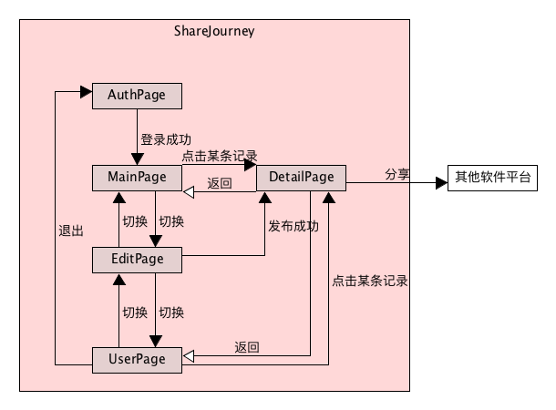
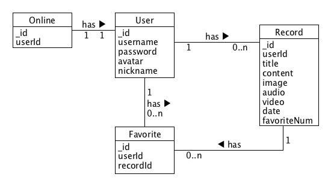

# Share Journey 嘻游记
> TAGs：分享、旅行记录、UWP Midterm project

## 1、协作规范
#### 1.1、准备工作
在github上fork我的仓库到你自己的github，将你fork之后自己的远程仓库克隆到本地，并在你的本地仓库上添加上游仓库，即源仓库(我的仓库)。
```bash
git clone https://github.com/{你的github}/ShareJourney
# 添加上游的源仓库地址，只需添加一次，后续不必再次添加
git remote add upstream https://github.com/hongchh/ShareJourney.git
```
#### 1.2、协作方式
开发完成某个功能，提交(commit)之后，同步(pull)上游仓库的更新。同步完成之后再将所有更新推送(push)到你自己的GitHub远程仓库上。最后再给我发送PR等待我的合并即可。
```bash
# 提交你的代码
git add *
git commit -m "add something"
# 拉取上游的源仓库dev分支上的更新，可能会有冲突需要自行解决
git pull upstream master
# 推送到你自己的远程仓库，注意这里是push到origin，不是upstream
git push origin master
```

## 2、界面结构
* MainPage: 主页面，显示多条旅行记录，点击某一条可以跳转到DetailPage
* DeatilPage: 详情页面，显示某条记录的详情
* UserPage: 用户个人信息页面，显示用户个人信息以及该用户发布的历史记录，点击某一条历史记录可以跳转到DetailPage
* AuthPage: 登录注册页面，成功登陆之后跳转到MainPage
* EditPage: 编辑界面，发布记录的时候跳转到该界面，发布成功之后跳到DetailPage



## 3、数据模型
用户数据模型
```json
{
  "user": {
    "_id": "uid, 数据库ID",
    "username": "string, 用户名",
    "password": "string, 密码",
    "nickname": "string, 昵称",
    "avatar": "string, 用户头像图片对应的URL"
  }
}
```
记录数据模型
```json
{
  "record": {
    "_id": "uid, 数据库ID",
    "userId": "uid, 发布该记录的用户的数据库ID",
    "title": "string, 标题",
    "content": "string, 描述",
    "image": "string, 图片链接URL",
    "audio": "string, 音频链接URL",
    "video": "string, 视频链接URL",
    "date": "date, 该记录发布时间的时间戳",
    "favoriteNum": "int, 点赞数量"
  }
}
```
点赞关系数据模型
```json
{
  "favorite": {
    "_id": "uid, 数据库ID",
    "userId": "uid, 用户数据库ID",
    "recordId": "uid, 记录数据库ID"
  }
}
```



## 4、文件结构
```txt
├─images-for-readme: 存放README中需要的图片文件
├─Server: 服务端源码
│   ├─model: 数据模型
│   ├─router: 接口路由
│   ├─index.js: 服务器配置和启动文件
│   └─package.json: NodeJS包管理文件
├─UWPApp: UWP应用源码
│   ├─UWPApp: UWP应用源码
│   │   ├─Assets: 静态资源文件，例如图片
│   │   ├─Helper: 工具库
│   │   │   ├─FileHelper.cs: 封装文件操作相关工具方法
│   │   │   └─NetworkHelper.cs: 封装网络访问相关工具方法
│   │   ├─Model: 应用的数据模型
│   │   │   └─Record.cs: 记录的数据模型
│   │   ├─Properties
│   │   ├─Store: 应用的全局数据状态管理
│   │   │   └─RecordStore.cs: 所有记录的数据状态管理
│   │   ├─View: 应用的视图文件
│   │   │   ├─AuthPage.xaml: 权限界面
│   │   │   ├─AuthPage.xaml.cs: 权限界面的业务逻辑
│   │   │   ├─DetailPage.xaml: 详情界面
│   │   │   ├─DetailPage.xaml.cs: 详情界面的业务逻辑
│   │   │   ├─EditPage.xaml: 编辑界面
│   │   │   ├─EditPage.xaml.cs: 编辑界面的业务逻辑
│   │   │   ├─MainPage.xaml: 主界面
│   │   │   ├─MainPage.xaml.cs: 主界面的业务逻辑
│   │   │   ├─UserPage.xaml: 用户界面
│   │   │   └─UserPage.xaml.cs: 用户界面的业务逻辑
│   │   ├─App.xaml: 最外层视图容器
│   │   ├─App.xaml.cs: 应用的启动文件
│   │   ├─Package.appxmanifest
│   │   ├─project.json
│   │   ├─project.lock.json
│   │   ├─UWPApp_TemproaryKey.pfx
│   │   └─UWPApp.csproj
│   └─UWPApp.sln: 解决方案管理文件
├─.gitignore: git忽略项配置文件
└─README.md: 项目文档
```

## 5、设计规范
* MDV/MVVM: model-driven-view，数据驱动视图。所有界面的渲染都由数据驱动，界面根据数据进行渲染，用户操作界面后产生的数据更新会同步到应用数据上，数据变化引起界面渲染更新。这里的思想与MVVM差别不大。
* 全局数据状态管理：整个应用的数据处于一个全局的位置，即Store。无论处于应用的哪个界面，所使用所操作的数据都来自同一个Store。为了实现这种全局状态管理，需要依赖单例模式，所以封装在Store文件夹下的类都需要实现为单例，并且保证线程安全。
* SoC: 关注点分离。每个模块负责相应的逻辑，为了更好地解耦合，将跟部分逻辑拆分，文件访问单独封装，网络访问单独封装，数据库操作单独封装，状态管理单独封装，每个xaml文件对应的cs文件里面只负责处理本界面下的逻辑。